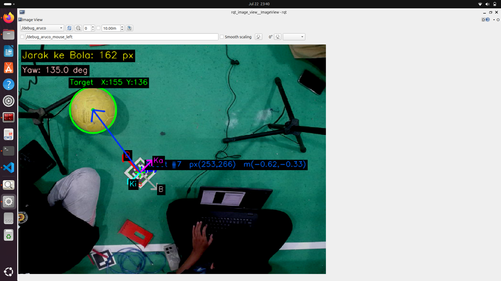
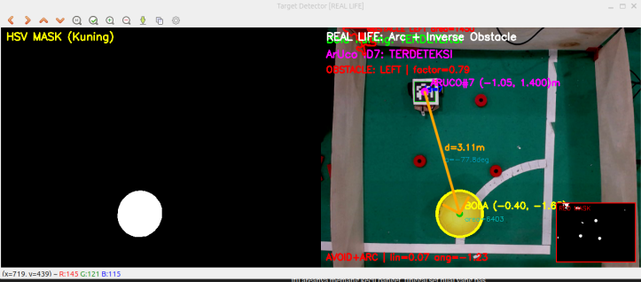

# 🤖 ROS2 ArUco Target Tracking Robot

A real-life vision-based robot control system using an overhead camera, ArUco marker localization, yellow target tracking, and orange obstacle avoidance — powered by ROS2 and ESP32 via UDP communication.

## 📸 Demo

### ArUco Detection & Target Tracking

### Obstacle Avoidance

---

## ✨ Features

- 📷 **Overhead Camera** — Camera mounted above the field for bird's-eye view
- 🎯 **ArUco Marker Localization** — Detects ArUco marker on top of robot for real-time position tracking
- 🟡 **Yellow Target Tracking** — Robot autonomously chases yellow-colored target using HSV color detection
- 🟠 **Orange Obstacle Avoidance** — Detects and avoids orange-colored obstacles (ARC + Inverse method)
- 📡 **UDP Communication** — Camera data sent to ESP32 on the robot wirelessly
- 🖥️ **GUI Control Panel** — Web-based interface for manual robot control

---

## 🛠️ Tech Stack

- **ROS2** — Robot middleware
- **OpenCV** — Computer vision (HSV masking, ArUco detection)
- **ESP32** — Robot motor controller (receives UDP commands)
- **Python** — ROS2 nodes
- **UDP Socket** — Wireless communication between PC and robot

---

## 🏗️ System Architecture

\`\`\`
Overhead Camera
      │
      ▼
ROS2 Node (PC)
  ├── ArUco Detection → Robot position (x, y, yaw)
  ├── HSV Detection   → Target position (yellow)
  └── HSV Detection   → Obstacle position (orange)
      │
      ▼ UDP
ESP32 (Robot)
  └── Motor Control
\`\`\`

---

## 📁 Project Structure

\`\`\`
Tulip_Gazebo/
├── src/               # ROS2 source nodes
├── launch/            # Launch files
├── config/            # Configuration files
├── scripts/           # Utility scripts
├── drive_robot_tulip/ # Robot drive nodes
├── web.html           # GUI control panel
├── tulip.urdf         # Robot URDF description
└── docs/              # Documentation & screenshots
\`\`\`

---

## 🚀 Getting Started

### Prerequisites

- Ubuntu 22.04
- ROS2 Humble/Jazzy
- OpenCV
- ESP32 (with motor driver)
- Overhead USB/IP Camera

### Installation

\`\`\`bash
git clone https://github.com/AsraDevi05/ros2-aruco-target-tracking.git
cd ros2-aruco-target-tracking
colcon build
source install/setup.bash
\`\`\`

---

## 📡 ROS2 Topics

| Topic | Type | Description |
|-------|------|-------------|
| \`/pose\` | \`geometry_msgs/Pose2D\` | Robot position from ArUco |
| \`/cmd_vel\` | \`geometry_msgs/Twist\` | Velocity command to robot |
| \`/debug_aruco\` | \`sensor_msgs/Image\` | Debug view with ArUco overlay |
| \`/image_raw\` | \`sensor_msgs/Image\` | Raw camera feed |

---

## 👩‍💻 Author

**Asra Devi Fanitya** — Robotics Engineering Technology  
Politeknik Negeri Batam
